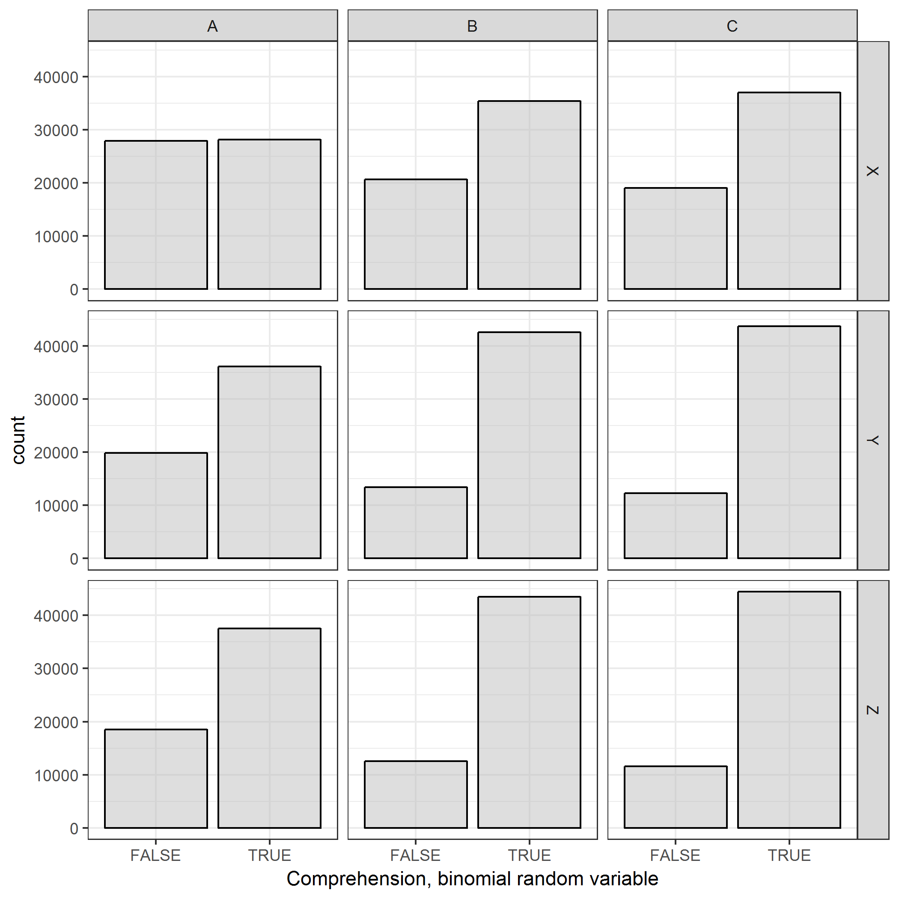
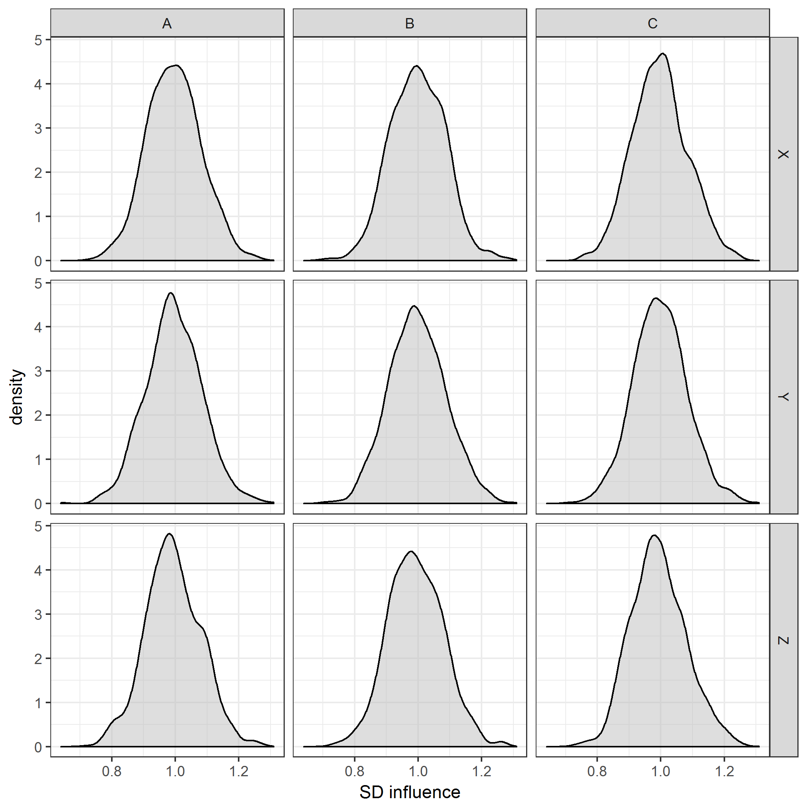
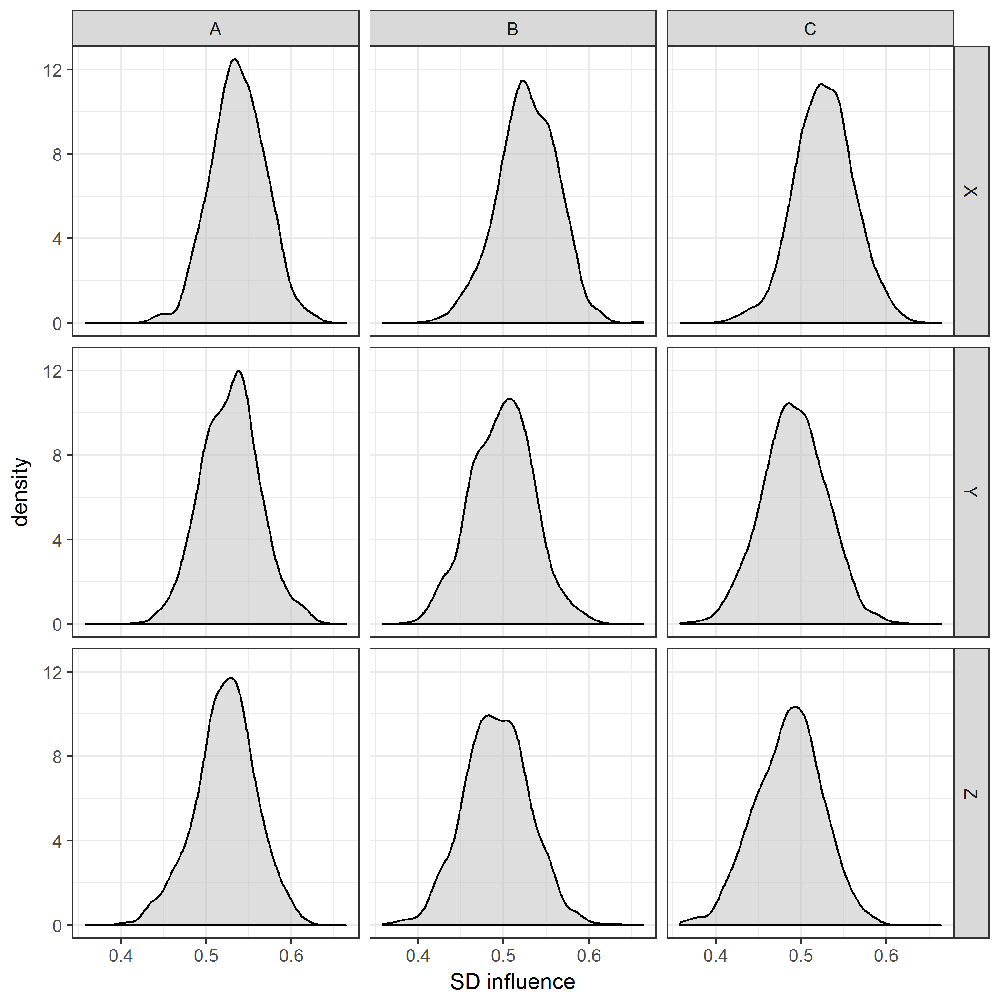
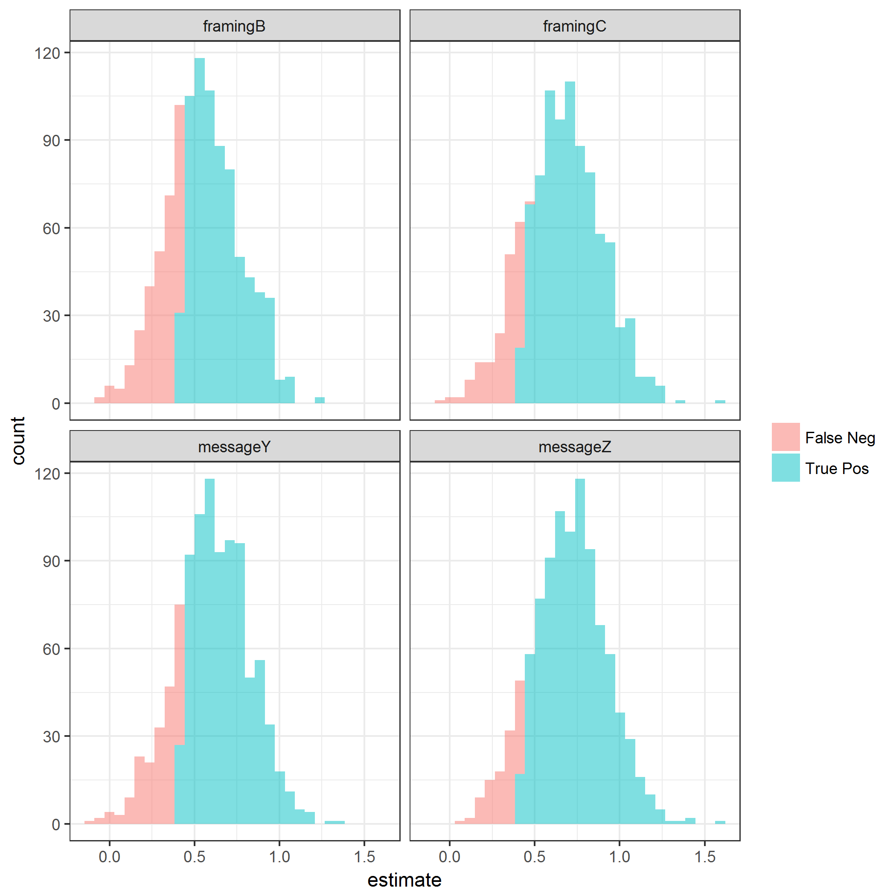
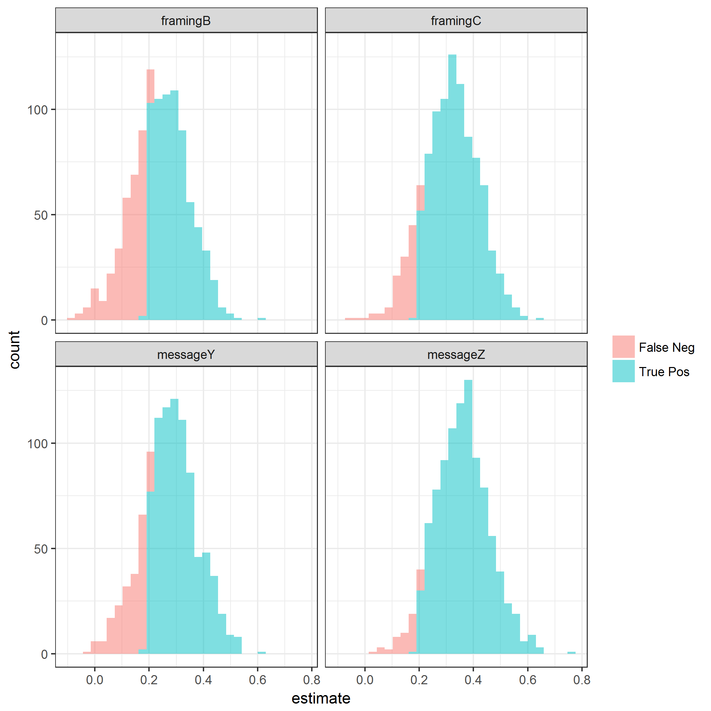

## Generate data


Study design is a two-factor, full factorial randomization.
The factors are **framing** and the **message** of the intervention.
Each factor has **3** levels.

Full sample size is **N = 500**.

Number of simulations is **S = 1000**.

The outcomes are **comprehension** and **influence**.


Comprehension is a dichotomous outcome.
Baseline comprehension is assumed to be **50%**.

Influence is a continuous outcome.
It represents pre-post change on a scale.
For analytic purposes, it will be scaled on a (-1, +1) continuum.
Baseline influence is assumed to be **0.00**.



|framing |message |    n| meanComprehension| nominalRiskRatio| nominalRiskDiff| meanInfluence| meanSD| meanCV| nominalEffectSize|
|:-------|:-------|----:|-----------------:|----------------:|---------------:|-------------:|------:|------:|-----------------:|
|A       |X       | 1000|             0.502|            1.000|           0.000|        -0.002|  0.536| 21.449|              0.00|
|A       |Y       | 1000|             0.646|            1.291|           0.146|         0.155|  0.528|  4.422|              0.54|
|A       |Z       | 1000|             0.670|            1.336|           0.169|         0.178|  0.522|  3.347|              0.62|
|B       |X       | 1000|             0.632|            1.268|           0.134|         0.147|  0.527|  2.631|              0.50|
|B       |Y       | 1000|             0.761|            1.519|           0.260|         0.286|  0.498|  1.871|              1.04|
|B       |Z       | 1000|             0.776|            1.555|           0.277|         0.305|  0.491|  1.740|              1.12|
|C       |X       | 1000|             0.660|            1.314|           0.158|         0.165|  0.526|  4.919|              0.58|
|C       |Y       | 1000|             0.780|            1.555|           0.278|         0.309|  0.491|  1.693|              1.12|
|C       |Z       | 1000|             0.793|            1.588|           0.294|         0.324|  0.484|  1.595|              1.20|



## Aim 1: Comprehension


|term     | samples| truePos| power| sampleSize|
|:--------|-------:|-------:|-----:|----------:|
|framingB |    1000|     639| 0.639|        500|
|framingC |    1000|     768| 0.768|        500|
|messageY |    1000|     718| 0.718|        500|
|messageZ |    1000|     842| 0.842|        500|




## Aim 2: Influence


|term     | samples| truePos| power|
|:--------|-------:|-------:|-----:|
|framingB |    1000|     670| 0.670|
|framingC |    1000|     793| 0.793|
|messageY |    1000|     754| 0.754|
|messageZ |    1000|     827| 0.827|




## Session summary


```
## $completionDateTime
## [1] "2018-05-15 07:55:44 PDT"
## 
## $executionTime
## Time difference of 52.93529 secs
## 
## $sessionInfo
## R version 3.4.3 (2017-11-30)
## Platform: x86_64-w64-mingw32/x64 (64-bit)
## Running under: Windows 7 x64 (build 7601) Service Pack 1
## 
## Matrix products: default
## 
## locale:
## [1] LC_COLLATE=English_United States.1252 
## [2] LC_CTYPE=English_United States.1252   
## [3] LC_MONETARY=English_United States.1252
## [4] LC_NUMERIC=C                          
## [5] LC_TIME=English_United States.1252    
## 
## attached base packages:
## [1] parallel  stats     graphics  grDevices utils     datasets  methods  
## [8] base     
## 
## other attached packages:
##  [1] bindrcpp_0.2.2    truncnorm_1.0-8   ggplot2_2.2.1    
##  [4] doParallel_1.0.11 iterators_1.0.9   foreach_1.4.4    
##  [7] broom_0.4.4       dplyr_0.7.4       magrittr_1.5     
## [10] rmarkdown_1.8     knitr_1.17        checkpoint_0.4.2 
## 
## loaded via a namespace (and not attached):
##  [1] Rcpp_0.12.16     highr_0.6        pillar_1.2.1     compiler_3.4.3  
##  [5] plyr_1.8.4       bindr_0.1.1      tools_3.4.3      digest_0.6.12   
##  [9] evaluate_0.10.1  tibble_1.4.2     nlme_3.1-131     gtable_0.2.0    
## [13] lattice_0.20-35  pkgconfig_2.0.1  rlang_0.2.0      psych_1.8.3.3   
## [17] cli_1.0.0        stringr_1.2.0    rprojroot_1.2    grid_3.4.3      
## [21] glue_1.2.0       R6_2.2.2         foreign_0.8-69   tidyr_0.8.0     
## [25] purrr_0.2.4      reshape2_1.4.3   backports_1.1.1  scales_0.5.0    
## [29] codetools_0.2-15 htmltools_0.3.6  assertthat_0.2.0 mnormt_1.5-5    
## [33] colorspace_1.3-2 labeling_0.3     utf8_1.1.3       stringi_1.1.5   
## [37] lazyeval_0.2.1   munsell_0.4.3    crayon_1.3.4
```
