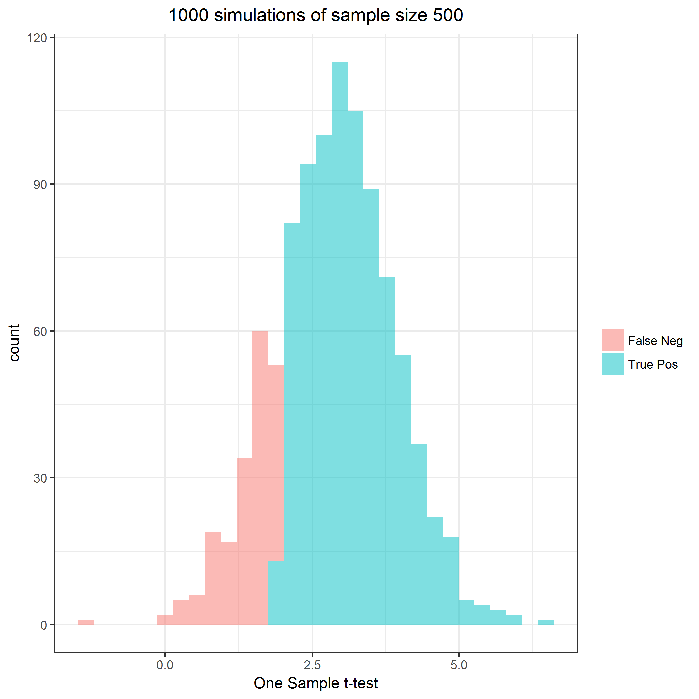
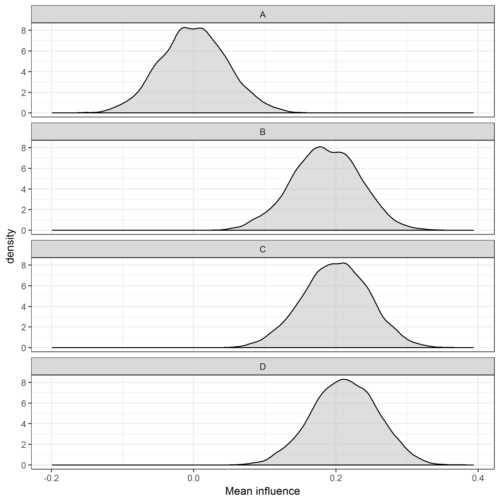
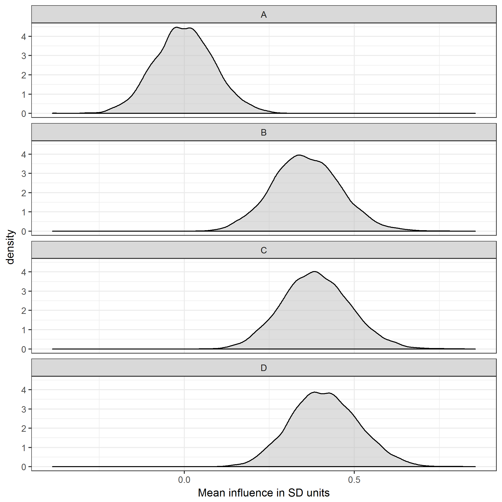

## Simulation parameters


Full sample size is **N = 600**.

Number of simulations is **S = 1000**.

The outcomes are **comprehension** and **influence**.


## Aim 1: Comprehension


Comprehension is a binomial outcome.
Integer values range from [0, 5].
With graphic **A**, comprehension is assumed to be **2.50**.
With graphic **B**, comprehension is assumed to be **2.71**.
Cohen's *d* = **0.18**

All subjects will have comprehension assessed with graphics A and B.
Order of presentation and message will be randomized.
Assumed test is a one-sample t-test.
$H_0$ is the mean difference in the number of correct responses between graphics A and B is zero.


```
## # A tibble: 4 x 4
## # Groups:   order, graphic [?]
##   order graphic scenario      n
##   <dbl> <fct>   <fct>     <int>
## 1    1. A       a        150003
## 2    1. A       b        149997
## 3    1. B       a        150118
## 4    1. B       b        149882
```

```
## # A tibble: 2 x 4
##   graphic      n  mean    sd
##   <fct>    <int> <dbl> <dbl>
## 1 A       600000  2.50  1.12
## 2 B       600000  2.70  1.11
```


| samples| truePos| power| sampleSize|
|-------:|-------:|-----:|----------:|
|    1000|     878| 0.878|        600|




## Aim 2: Influence


Influence is a continuous outcome.
For analytic purposes, it will be scaled on a (-1, +1) continuum.
With video **A**, influence is assumed to be **0.00**.
With video **B**, influence is assumed to be **0%**.
With video **C**, influence is assumed to be **1%**.
With video **D**, influence is assumed to be **1%**.
Standard deviation is assumed to be equal across video groups with value **1%**

Since the metric is bounded by -1 and +1, a truncated normal distribution is simulated.
The simulated means will be different that the specified nominal means above.


|video |    n| meanInfluence| meanSD|  meanZ|    meanCV| nominalEffectSize|
|:-----|----:|-------------:|------:|------:|---------:|-----------------:|
|A     | 1000|         0.000|  0.539| -0.001| -3789.397|             0.000|
|B     | 1000|         0.140|  0.530|  0.266|     4.246|             0.500|
|C     | 1000|         0.193|  0.520|  0.373|     2.859|             0.675|
|D     | 1000|         0.212|  0.517|  0.413|     2.571|             0.750|



|comparison | meanCohenD|  sdCohenD|
|:----------|----------:|---------:|
|B vs A     |  0.2634418| 0.1131080|
|C vs A     |  0.3657760| 0.1132318|
|D vs A     |  0.4030679| 0.1212820|


|term   | meanEstimate| sdEstimate| meanStatistic| samples| truePos| power|
|:------|------------:|----------:|-------------:|-------:|-------:|-----:|
|videoB |    0.1405361|  0.0597307|      2.311721|    1000|     638| 0.638|
|videoC |    0.1934688|  0.0588582|      3.182694|    1000|     897| 0.897|
|videoD |    0.2123909|  0.0620582|      3.494518|    1000|     925| 0.925|




## Session summary


```
## $completionDateTime
## [1] "2018-05-31 14:08:19 PDT"
## 
## $executionTime
## Time difference of 1.091126 mins
## 
## $sessionInfo
## R version 3.4.3 (2017-11-30)
## Platform: x86_64-w64-mingw32/x64 (64-bit)
## Running under: Windows 7 x64 (build 7601) Service Pack 1
## 
## Matrix products: default
## 
## locale:
## [1] LC_COLLATE=English_United States.1252 
## [2] LC_CTYPE=English_United States.1252   
## [3] LC_MONETARY=English_United States.1252
## [4] LC_NUMERIC=C                          
## [5] LC_TIME=English_United States.1252    
## 
## attached base packages:
## [1] parallel  stats     graphics  grDevices utils     datasets  methods  
## [8] base     
## 
## other attached packages:
##  [1] tidyr_0.8.0       bindrcpp_0.2.2    truncnorm_1.0-8  
##  [4] ggplot2_2.2.1     doParallel_1.0.11 iterators_1.0.9  
##  [7] foreach_1.4.4     broom_0.4.4       dplyr_0.7.4      
## [10] magrittr_1.5      rmarkdown_1.8     knitr_1.17       
## [13] checkpoint_0.4.2 
## 
## loaded via a namespace (and not attached):
##  [1] Rcpp_0.12.16     highr_0.6        pillar_1.2.1     compiler_3.4.3  
##  [5] plyr_1.8.4       bindr_0.1.1      tools_3.4.3      digest_0.6.12   
##  [9] evaluate_0.10.1  tibble_1.4.2     nlme_3.1-131.1   gtable_0.2.0    
## [13] lattice_0.20-35  pkgconfig_2.0.1  rlang_0.2.0      psych_1.8.3.3   
## [17] cli_1.0.0        stringr_1.2.0    tidyselect_0.2.4 rprojroot_1.2   
## [21] grid_3.4.3       glue_1.2.0       R6_2.2.2         foreign_0.8-69  
## [25] purrr_0.2.4      reshape2_1.4.3   backports_1.1.1  scales_0.5.0    
## [29] codetools_0.2-15 htmltools_0.3.6  assertthat_0.2.0 mnormt_1.5-5    
## [33] colorspace_1.3-2 labeling_0.3     utf8_1.1.3       stringi_1.1.5   
## [37] lazyeval_0.2.1   munsell_0.4.3    crayon_1.3.4
```
