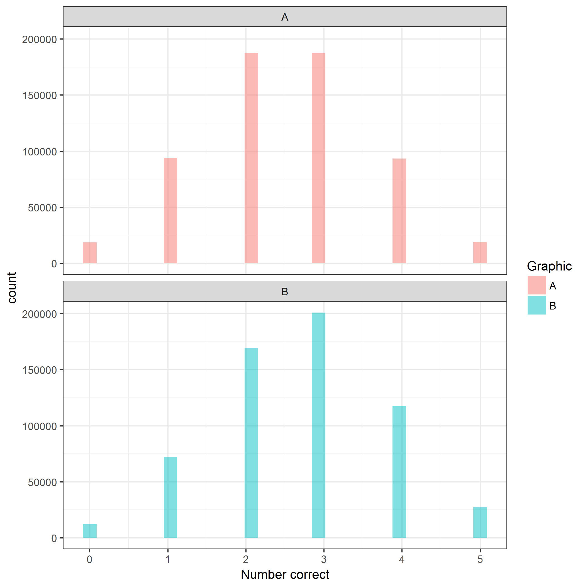
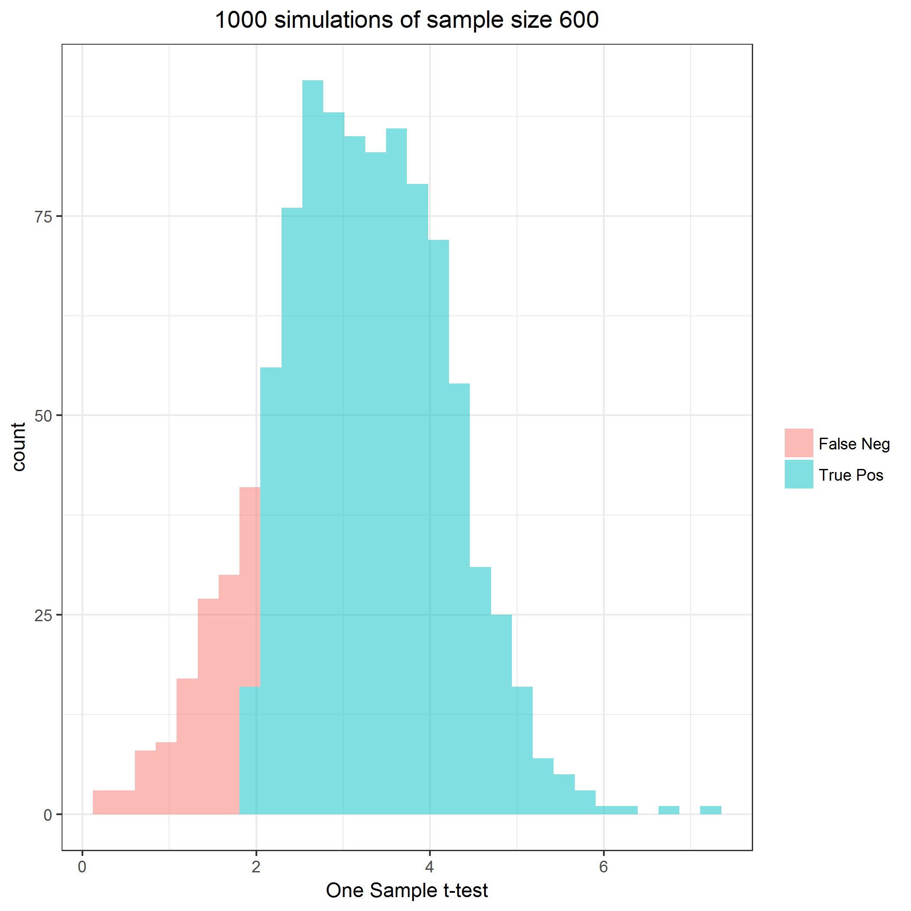
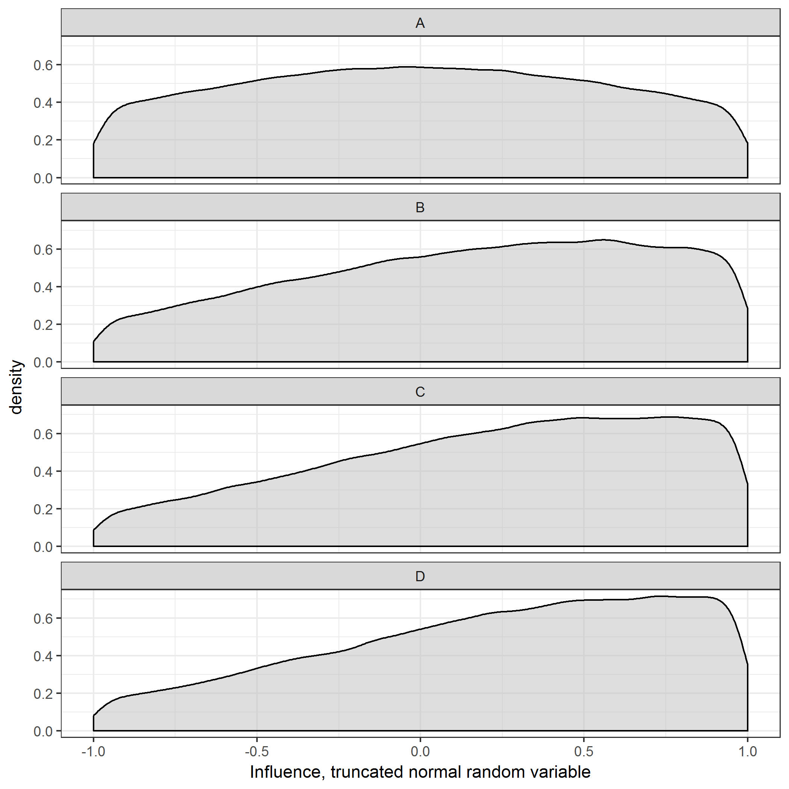
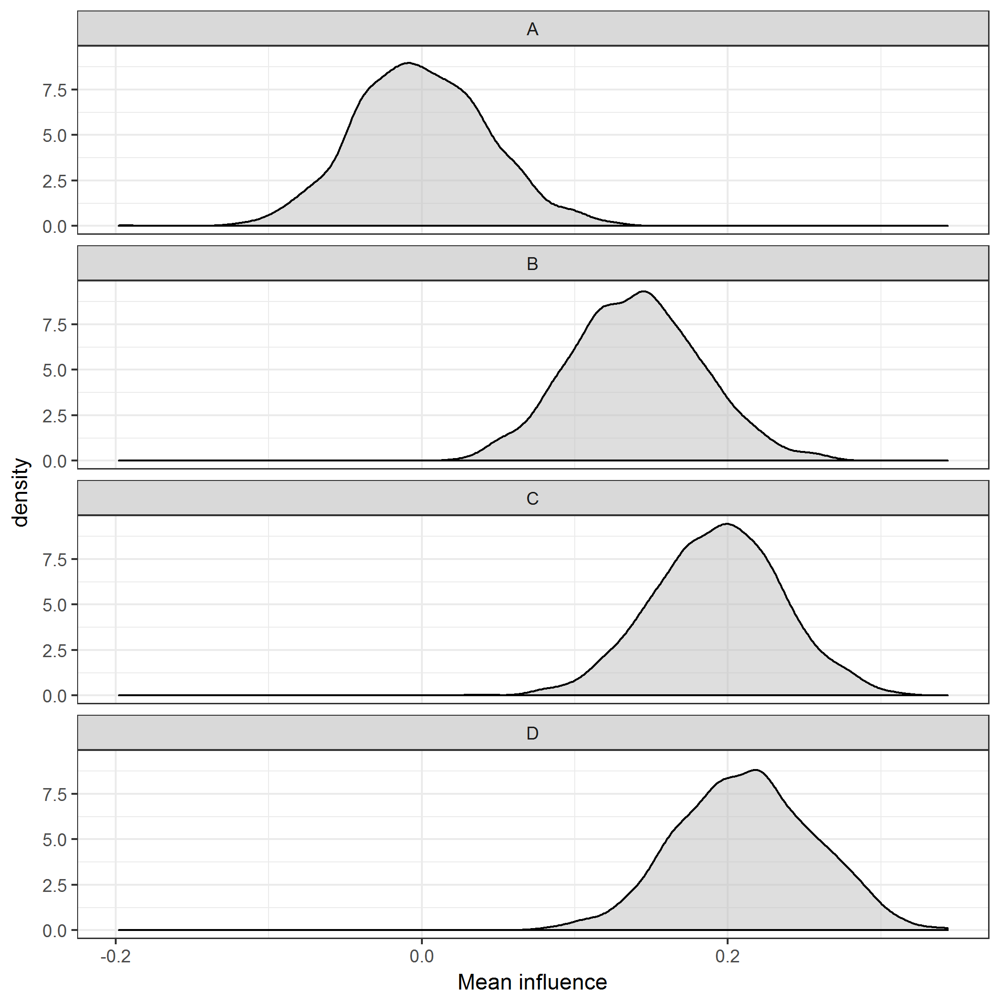
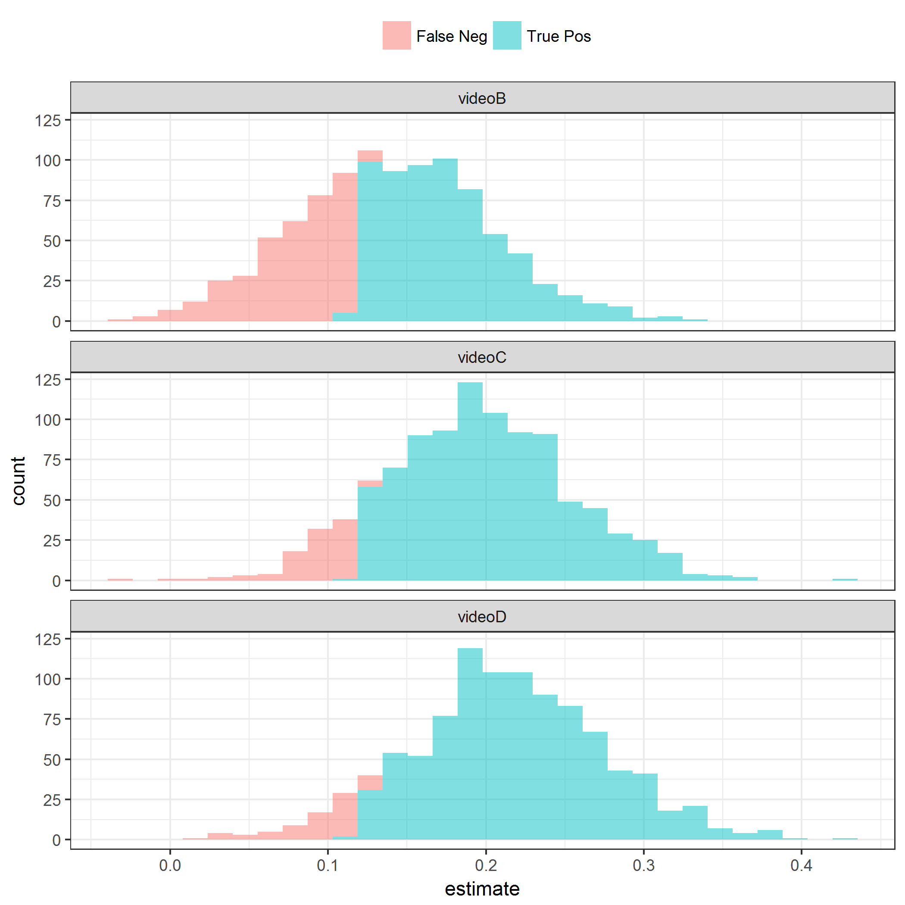

## Simulation parameters


Full sample size is **N = 500**.

Number of simulations is **S = 1000**.

The outcomes are **comprehension** and **influence**.


## Aim 1: Comprehension


Comprehension is a binomial outcome.
Integer values range from [0, 5].
With graphic **A**, comprehension is assumed to be **2.50**.
With graphic **B**, comprehension is assumed to be **2.71**.
Cohen's *d* = **0.18**

All subjects will have comprehension assessed with graphics A and B.
Order of presentation and message will be randomized.
Assumed test is McNemar's chi-square for paired proportions.
$H_0$ is there is no difference in the comprehension proportions between graphics A and B.


```
## # A tibble: 4 x 4
## # Groups:   order, graphic [?]
##   order graphic scenario      n
##   <dbl> <fct>   <fct>     <int>
## 1    1. A       a        124728
## 2    1. A       b        125272
## 3    1. B       a        124952
## 4    1. B       b        125048
```

```
## # A tibble: 2 x 4
##   graphic      n  mean    sd
##   <fct>    <int> <dbl> <dbl>
## 1 A       500000  2.50  1.12
## 2 B       500000  2.70  1.11
```



| samples| truePos| power| sampleSize|
|-------:|-------:|-----:|----------:|
|    1000|     816| 0.816|        500|




## Aim 2: Influence


Influence is a continuous outcome.
For analytic purposes, it will be scaled on a (-1, +1) continuum.
With video **A**, influence is assumed to be **0.00**.
With video **B**, influence is assumed to be **0%**.
With video **C**, influence is assumed to be **1%**.
With video **D**, influence is assumed to be **1%**.
Standard deviation is assumed to be equal across video groups with value **1%**

Since the metric is bounded by -1 and +1, a truncated normal distribution is simulated.
The simulated means will be different that the specified nominal means above.



|video |    n| meanInfluence| meanSD|  meanZ| meanCV| nominalEffectSize|
|:-----|----:|-------------:|------:|------:|------:|-----------------:|
|A     | 1000|        -0.001|  0.540| -0.003| 31.149|             0.000|
|B     | 1000|         0.145|  0.529|  0.276|  4.755|             0.500|
|C     | 1000|         0.192|  0.523|  0.369|  2.986|             0.675|
|D     | 1000|         0.212|  0.515|  0.414|  2.590|             0.750|



|comparison | meanCohenD|  sdCohenD|
|:----------|----------:|---------:|
|B vs A     |  0.2750017| 0.1303337|
|C vs A     |  0.3640327| 0.1304287|
|D vs A     |  0.4051573| 0.1308812|


|term   | meanEstimate| sdEstimate| meanStatistic| samples| truePos| power|
|:------|------------:|----------:|-------------:|-------:|-------:|-----:|
|videoB |    0.1465487|  0.0683979|      2.201172|    1000|     600| 0.600|
|videoC |    0.1929651|  0.0676804|      2.898529|    1000|     809| 0.809|
|videoD |    0.2130817|  0.0669771|      3.201037|    1000|     883| 0.883|




## Session summary


```
## $completionDateTime
## [1] "2018-05-31 13:33:57 PDT"
## 
## $executionTime
## Time difference of 1.185517 mins
## 
## $sessionInfo
## R version 3.4.3 (2017-11-30)
## Platform: x86_64-w64-mingw32/x64 (64-bit)
## Running under: Windows 7 x64 (build 7601) Service Pack 1
## 
## Matrix products: default
## 
## locale:
## [1] LC_COLLATE=English_United States.1252 
## [2] LC_CTYPE=English_United States.1252   
## [3] LC_MONETARY=English_United States.1252
## [4] LC_NUMERIC=C                          
## [5] LC_TIME=English_United States.1252    
## 
## attached base packages:
## [1] parallel  stats     graphics  grDevices utils     datasets  methods  
## [8] base     
## 
## other attached packages:
##  [1] tidyr_0.8.0       bindrcpp_0.2.2    truncnorm_1.0-8  
##  [4] ggplot2_2.2.1     doParallel_1.0.11 iterators_1.0.9  
##  [7] foreach_1.4.4     broom_0.4.4       dplyr_0.7.4      
## [10] magrittr_1.5      rmarkdown_1.8     knitr_1.17       
## [13] checkpoint_0.4.2 
## 
## loaded via a namespace (and not attached):
##  [1] Rcpp_0.12.16     highr_0.6        pillar_1.2.1     compiler_3.4.3  
##  [5] plyr_1.8.4       bindr_0.1.1      tools_3.4.3      digest_0.6.12   
##  [9] evaluate_0.10.1  tibble_1.4.2     nlme_3.1-131.1   gtable_0.2.0    
## [13] lattice_0.20-35  pkgconfig_2.0.1  rlang_0.2.0      psych_1.8.3.3   
## [17] cli_1.0.0        stringr_1.2.0    tidyselect_0.2.4 rprojroot_1.2   
## [21] grid_3.4.3       glue_1.2.0       R6_2.2.2         foreign_0.8-69  
## [25] purrr_0.2.4      reshape2_1.4.3   backports_1.1.1  scales_0.5.0    
## [29] codetools_0.2-15 htmltools_0.3.6  assertthat_0.2.0 mnormt_1.5-5    
## [33] colorspace_1.3-2 labeling_0.3     utf8_1.1.3       stringi_1.1.5   
## [37] lazyeval_0.2.1   munsell_0.4.3    crayon_1.3.4
```
